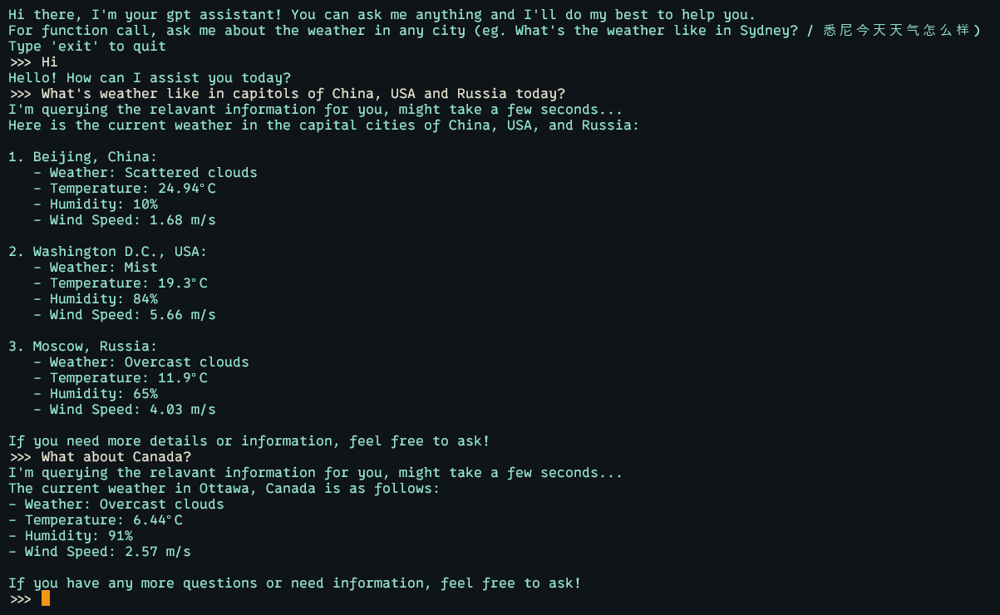

# Natural Language to API Call in Your Termimal

## About

- A polyglot gpt assistant that answers any question for you
- Support checking weather of the current day in one or more locations
- Locations can be inferred intelligently from your conversation

## Quick Start

### Environment setup

\* _This project has only been tested on NodeJS v.20.12.2_

`cp .env.example .env` and configure `.env`

| API_KEY                | Description                                                                                                                                            |
| ---------------------- | ------------------------------------------------------------------------------------------------------------------------------------------------------ |
| OPENWEATHERMAP_API_KEY | API Key in your OpenWeatherMap account: [https://home.openweathermap.org/api_keys](https://home.openweathermap.org/api_keys)                           |
| OPENAI_API_KEY         | API Key in your OpenAI account: [https://platform.openai.com/settings/profile?tab=api-keys](https://platform.openai.com/settings/profile?tab=api-keys) |
| OPENAI_MODEL           | By default: `gpt-3.5-turbo`. View a list of available models from OpenAI: https://platform.openai.com/docs/models                                      |

### Run the project

#### Docker

- Coming soon...

#### Local

- If you don't have `pnpm` yet, install it by running `npm i -g pnpm`, or checkout the [official installation guide](https://pnpm.io/installation)
- `pnpm i`
- `npm start`

## Roadmap

- [ ] Add initial system prompt to increase accuracy

- [ ] Docker

- [ ] Rewrite with TypeScript

- [ ] Refactor with proper OOP, ideally a plugin system

- [ ] More APIs

## Resources on function calling

- https://platform.openai.com/docs/guides/function-calling
- https://towardsdatascience.com/create-an-agent-with-openai-function-calling-capabilities-ad52122c3d12
